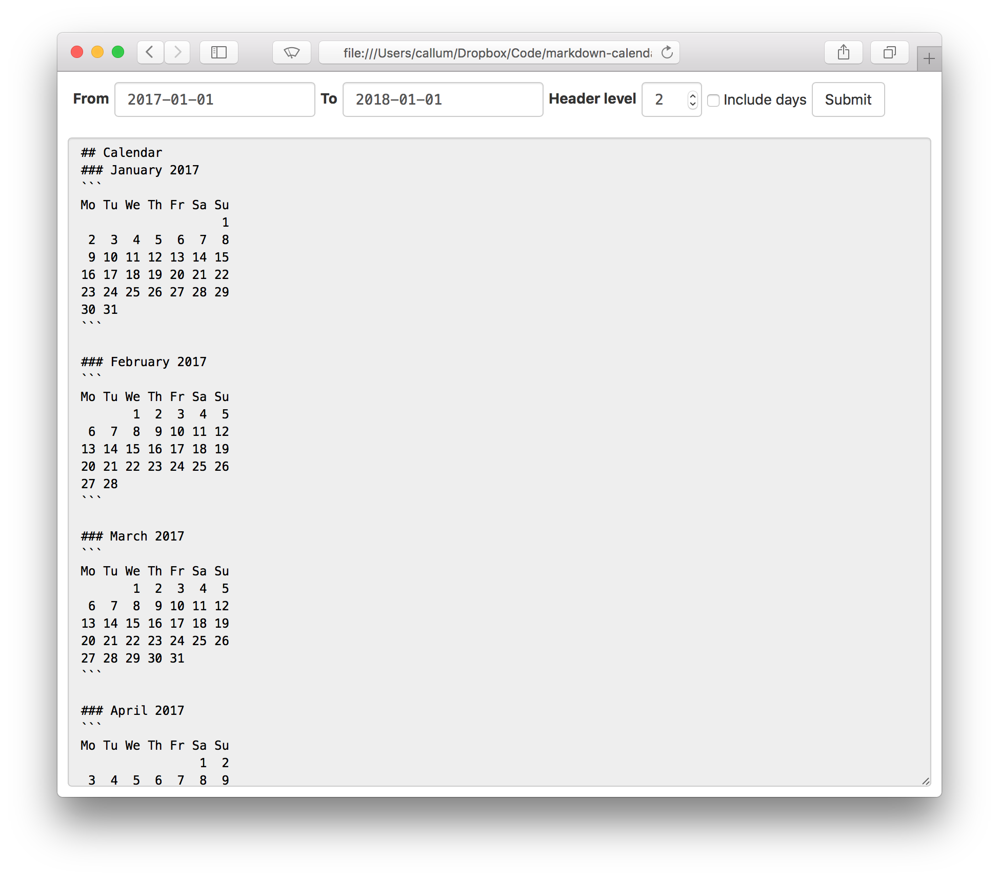

# Markdown calendar generator
Given an appropriate range of dates, spits out a plaintext (well, markdown) calendar.

Dates must be in the format `yyyy-mm-dd`.

*Header Level* indicates the number of `#`s to put on the first line (so that you can have your `## Calendar` be a subheading within a larger document.) Months and then days are then each a header level higher.

Check *Include days* if you want to fill your calendar out with blank entries for each day, or leave it unchecked if you would rather fill in days manually as needed.



## Building
Assuming you have elm and bower installed. Clone and run

```
elm make Main.elm --output=markdown-calendar.js && bower install
```

in the root of this directory. Then just open `index.html` in your favourite browser.